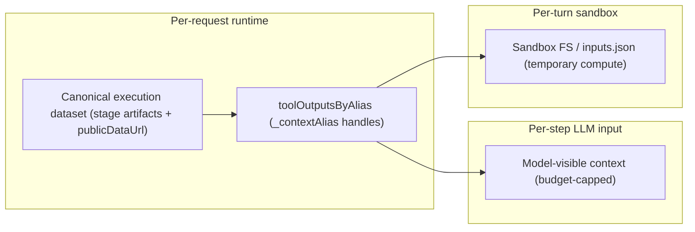

The Context Query runtime exposes a managed `code_interpreter` tool that the
agent can call after MCP retrieval to derive metrics, build chart artifacts,
or render matplotlib visuals from data already fetched. The interpreter runs
**Python 3.13** inside a **Vercel Sandbox** Firecracker microVM with a
pre-built snapshot of the pure-compute scientific Python stack
(`pandas`, `numpy`, `scipy`, `matplotlib`, `statsmodels`, `pyarrow`).

## Data flow contract (load-bearing)

The interpreter is for **derivation, not data acquisition**. Data flows in
one direction only:

1. The AI SDK turn loop runs in plain Node.js inside the chat API route.
2. The agent calls MCP tools (`call_mcp_skill`, `get_earnings`,
   `get_price`, etc.). These are HTTP fetches from Node to contributor
   servers and accumulate in `toolOutputsByAlias`.
3. Optionally the agent calls `code_interpreter` to derive metrics or
   produce custom plots. Prior tool outputs are auto-bound by their
   canonical `_contextAlias` as Python globals and as `inputs[...]`
   entries. The optional `inputs: Record<localName, alias>` mapping is
   only friendly-name sugar for dense scripts.
4. The runtime hydrates those inputs, serializes them as
   `/vercel/sandbox/inputs.json`, then runs Python.
5. Python reads the bound aliases / `inputs`, computes results, calls
   `save_figure(alt, title)` for matplotlib PNGs when a visual is needed,
   and calls `set_result(value)` with the final JSON-serializable result.
6. The sandbox returns `stdout`, `result`, plus chart and image artifacts
   back into the Node loop. Image PNGs are uploaded to Vercel Blob and
   exposed as `ImageArtifact` URLs.

**Python never makes HTTP, network, marketplace, or filesystem-egress
calls.** This is enforced at four layers:

- **Snapshot composition.** The pre-built sandbox image deliberately
  omits `requests`, `urllib3`, `httpx`, `aiohttp`, and `yfinance`. Even
  if the model writes `import requests`, the import fails at runtime.
- **`networkPolicy: "deny-all"`.** Each sandbox is created with a
  Firecracker network policy that blocks outbound traffic. Python's
  stdlib `urllib` cannot escape the microVM. Verified by the
  `python sandbox: networkPolicy deny-all blocks outbound HTTP`
  integration test.
- **Librarian prompt.** The agent prompt explicitly forbids
  network-fetching imports and lists only the allowed libraries. The
  prompt is contributor-agnostic and does not name venues.
- **`validateCodeInterpreterContract`.** Every `code_interpreter` call must
  declare a `postProcessingContract` with `operation`, `reason`,
  `inputAliases`, and `expectedArtifacts`. The contract is validated before
  Python starts so malformed tool input becomes a repairable model error
  instead of an unclassified sandbox failure.

## Lazy-per-turn lifecycle

Most chat turns never call `code_interpreter`. Those turns pay zero
sandbox cost. When the agent calls the interpreter for the first time
within a turn, the runtime lazy-creates a Vercel Sandbox booted from the
snapshot (sub-second cold start) via `getOrCreateTurnSandbox(...)`. All
subsequent interpreter calls in the same turn reuse that sandbox. The
sandbox is disposed in a `finally` block around the turn's
`streamText` / `generateText` call by `disposeTurnSandbox(...)`.

The sandbox lifetime is intentionally longer than an individual Python command
timeout. The microVM is kept warm for up to 15 minutes so multi-step analysis
can reuse cached inputs and intermediate files, while each `runPythonInSandbox`
command still defaults to a 60-second abort budget. In other words: the runtime
allows a long analytical turn, but still kills a single runaway script quickly.

## Storage layers



The code interpreter spans three storage layers with different durability and
budget rules:

- **Model-visible context** is the per-step tool result payload the execution
  model rereads. This layer is budget-capped and may be compacted under prompt
  pressure, but it always preserves enough metadata for the model to reference
  the original dataset again.
- **Runtime alias store + canonical dataset** is the durable evidence layer for
  the request. `toolOutputsByAlias` keeps the full raw tool outputs keyed by
  `_contextAlias`, and the canonical execution dataset / stage artifacts /
  `publicDataUrl` preserve the answer backing data for synthesis and downloads.
- **Sandbox FS** is ephemeral compute state only. The runtime writes
  `/vercel/sandbox/inputs.json`, `bootstrap.py`, user code, and generated
  figures there so Python can execute, but the filesystem is never the only
  copy of important data.

`_contextAlias` is therefore the Python-facing addressing scheme, not the
durable evidence layer by itself. Compaction only targets what the LLM rereads;
the alias store and canonical dataset remain full fidelity.

```
┌─ Node turn loop ──────────────────────────────────────┐
│  MCP tools (fetch + HTTP)        ◀── never sandboxed   │
│  code_interpreter[1]             ─▶ Sandbox.create     │
│  code_interpreter[2..N]          ─▶ reuse sandbox      │
│  finalResponse                   ◀── never sandboxed   │
│  finally { disposeTurnSandbox }  ─▶ Sandbox.stop       │
└────────────────────────────────────────────────────────┘
```

## Artifacts emitted by `code_interpreter`

- **Image artifact (`kind: "image"`).** Matplotlib PNG saved to
  `/vercel/sandbox/out/images/`, uploaded to Vercel Blob (sha256
  content-addressed), and rendered inline as an `` in the message
  body. Emit via `save_figure(alt, title=None, fig=None)` after building
  the matplotlib `Figure`.

Every emitted artifact must match the agent's declared
`postProcessingContract.expectedArtifacts` (`["image"]` for matplotlib
figures, or `[]` for computation-only calls); the runtime rejects a call
that declares an image but does not emit one. When a figure is emitted, the
sandbox also reports low-coverage plotted time-series lines so the runtime can
force a `python_code_edit` repair instead of finalizing a visibly sparse chart.

## Time-series alignment helpers

The sandbox exposes contributor-agnostic helpers for common data-shaping
failure modes. `safe_merge_timeseries(...)` and `align_timeseries(...)`
normalize timestamp buckets, aggregate duplicate buckets, and attach
data-quality diagnostics before chart code runs. When `names=[...]` is passed,
the helpers keep prefixed columns for disambiguation and also preserve
unprefixed aliases for columns that are globally unique across the merged
sources. For example, a merge may expose both `cg_net_flow` and `net_flow`, but
only if no other source also has a `net_flow` column.

## Coverage-aware change helpers

When a user asks for a total, aggregate, net change, flow, threshold event, or
regime across many entities, the metric scope is the full requested population.
Top-N, selected-entity, representative, or readability subsets are display
choices only; they must not define the requested metric unless the user
explicitly asked for that bounded subset.

`derive_change_series(...)` is the contributor-agnostic helper for changing
entity populations. It accepts wide matrices (one entity per numeric column)
and long rows (`time_col`, `entity_col`, `value_col`), then returns
`total_value`, `total_change`, `stable_entities_change`, `coverage_change`,
and optional `selected_entities_change`.

This keeps display choices from changing the answer. For example, top-N rows
may be useful as a breakdown, but they must not replace the whole-population
`total_change` when the requested chart is a total.

### Flow vs. coverage transitions

A per-period change is only a real **flow** for entities observed in both
adjacent periods. When the observed (non-null) membership changes — an entity is
first listed, delisted, or has a reporting gap then resumes — the choice of
aggregation silently decides the answer:

- **Sum-then-diff** (`total_change`) absorbs the entering/leaving entity as if it
  were one-period movement. A venue first appearing at 35k BTC looks like a 35k
  inflow.
- **Diff-then-sum** drops that entity's NaN delta, so the swing silently
  disappears — the symptom users describe as a "missing data point."

`derive_change_series(...)` resolves this by returning both views plus the
disclosure layer: headline `stable_entities_change` as the real flow, and
surface `coverage_change` (with `entering_entity_count` / `exiting_entity_count`)
as an annotated layer — never as a flow bar, never silently dropped. The
invariant `total_change == stable_entities_change + coverage_change` holds every
period, and `coverage_events` names which entities moved in or out. This is
contributor-agnostic: it applies to any entity set whose membership changes over
time, not just exchange venues.

Timestamp normalization is part of the metric, not cleanup. After flooring
timestamps to a coarser bucket, aggregate duplicate buckets with an explicit
policy before computing changes. Do not `drop_duplicates(..., keep="first")`
or `dropna()` your way through duplicates: some contributors emit a null
placeholder bucket followed by a real sample in the same logical day/hour.

For inventory, balance, reserve, holdings, open-interest, supply, or other
stock/level series, the default sign convention is structural: a positive level
delta is net flow into that inventory/location, and a negative level delta is
net flow out. Invert the sign only when the source field is already a flow
metric with an explicit opposite convention.

## Step budget for chart-required turns

When the planning contract declares `chartIntent: "explicit"`, the
runtime increases the per-turn step budget. This gives the agent room for MCP
fetch + matplotlib generation with `code_interpreter` + retry on shape,
alignment, or artifact failures, while still bounding total compute.

If the agent still hits the budget without producing a chart, the
runtime synthesizes a `buildBestEffortTerminalOutcome(...)` answer and
explicitly surfaces a `gaps` entry telling synthesis that the chart
could not be rendered. Synthesis must communicate the failure honestly
to the user instead of dropping the visual silently.

## Observability

Every `runPythonInSandbox(...)` call emits structured runtime probes
on stdout:

- `[python-sandbox-latency-probe] event=python_call_start` once per
  call, with `inputsBytes`, `codeBytes`, `inputAliasCount`, sandbox id.
- `[python-sandbox-latency-probe] event=python_call_success` on
  success with `stdoutChars`, `artifactCount`, per-kind counts.
- `[python-sandbox-latency-probe] event=python_call_failure` on any
  failure with the failing `stage` and an error message.

These probes mirror the `[mcp-latency-probe]` pattern used by the
marketplace dispatcher and let operations dashboards measure cold-start
vs warm boot, exit codes, and artifact emission rates per turn.
