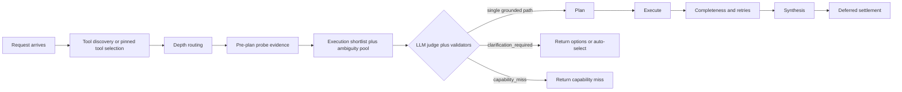

## What this document is for

Use this page as the canonical mental model for how Context's server-managed agentic flow works across both public Query surfaces:

- `/api/v1/query` for SDK/API callers
- `/api/chat` for the first-party chat UI

The two routes are not separate orchestration systems. They are two entry surfaces over the same core flow:

1. Normalize the request
2. Discover or accept selected tools
3. Choose a depth lane
4. Build pre-plan evidence
5. Decide whether to answer, clarify, or capability-miss
6. Plan and execute
7. Check completeness, synthesize, and settle

---

## Shared Mental Model

The simplest way to reason about the runtime is:

- **Discovery/selection decides the tool universe**
- **The pre-plan probe decides what the runtime knows before planning**
- **Method reasoning produces both an execution track and an ambiguity track**
- **Clarification decides whether the user must disambiguate before planning/execution**
- **Planning/execution only start after clarification has either not triggered or has been resolved**

That placement is intentional. Clarification is a gate **between tool selection and planning**, not a post-planning UX patch.



---

## Route Responsibilities

### `/api/v1/query`

This is the SDK/API surface. It accepts things like:

- `query`
- pinned `tools`
- `queryDepth`
- `clarificationPolicy`
- `includeDeveloperTrace`

It is the best surface for precise regression testing because it exposes the most explicit controls.

### `/api/chat`

This is the first-party conversational surface. It adds chat-session state and UI behavior, but it still uses the same depth/scout/clarification core.

The main clarification-specific difference is policy mapping:

- chat toggle off -> `clarificationPolicy = "return"`
- chat toggle on -> `clarificationPolicy = "auto"`

That mapping is implemented through shared clarification policy logic so the chat route does not invent a separate ambiguity system.

### Answer-Model Semantics

Both entry surfaces now expose only one public model knob: the **answer model** used for final synthesis.

- Chat keeps the legacy wire field name `selectedChatModel`, but it is interpreted as the answer model for the final response.
- `/api/v1/query` exposes `answerModelId` for the same purpose.
- If `responseShape="evidence_only"`, synthesis is skipped and no answer model runs.
- Internal stages such as tool selection, clarification, planning, repair, and completeness checks stay on the managed portfolio rather than inheriting the public answer-model choice.

## Contributor Retrieval Boundary

The runtime on this page is responsible for marketplace-generic discovery, clarification, planning, execution, and synthesis. It is **not** responsible for venue-specific candidate resolution inside contributor methods.

If a contributor adopts the optional pattern described in [Optional Contributor Search Helpers](/guides/optional-contributor-search-helpers):

- the helper stays contributor-side and optional
- the contributor still owns upstream retrieval, local reranking, provenance, and schema validation
- any LLM judge stays inside a deterministic safety envelope
- the runtime may surface standardized diagnostics such as `QueryDeveloperTraceDiagnostics.contributorSearches`, but it must not absorb venue-specific retrieval logic or contributor provider credentials

---

## Demand-Side Wedge Contract

The generic runtime contract on this page is no longer the only promotion gate for future Query changes.

The current demand-side source of truth is the `liquidity heatmap / exchange-flow intelligence` wedge contract:

- [Liquidity Heatmap and Exchange-Flow Wedge Contract](/architecture/liquidity-heatmap-exchange-flow-wedge-contract)

Use that document for:

- the locked must-win prompts
- the exact evidence fields premium Query answers must expose
- the initial response-shape targets: `answer`, `answer_with_evidence`, `evidence_only`
- the freshness windows, ambiguity rules, and failure criteria future runtime changes must beat

The existing ambiguity/capability anchors in this document remain necessary compatibility checks, but they are no longer sufficient evidence by themselves for promoting new Query behavior.

For rollout decisions, treat the wedge as green only when all of these hold together:

- the required wedge prompts pass locally
- the same required prompts pass on the deployed runtime
- first-party chat still renders the shared `answer_with_evidence` Query envelope cleanly
- external agent callers can consume both `answer_with_evidence` and `evidence_only`
- the public SDK/docs surfaces still describe the same response-shape contract

---

## Lane Semantics

The runtime has two practical execution lanes.

| Lane | Runtime contract | Probe posture | Planning posture | Typical use |
|------|------------------|---------------|------------------|-------------|
| `fast` | `methodReasoningEnabled=false`, `ambiguityJudgeEnabled=false`, `externalProbeEnabled=false`, `preserveFastOneShot=true` | No meaningful pre-plan reasoning | Focused, minimal recovery | Straightforward one-shot requests |
| `deep` | `methodReasoningEnabled=true`, `ambiguityJudgeEnabled=true`, `externalProbeEnabled=false`, `preserveFastOneShot=false` | Metadata-first reasoning before planning | Focused planning with more recovery than `fast` | Completeness-oriented, ambiguous, or multi-tool requests |

### The important distinctions

- `scoutEnabled` is no longer the best mental model for deep-lane behavior.
- `methodReasoningEnabled`, `ambiguityJudgeEnabled`, and `externalProbeEnabled` are the source-of-truth capability flags.

The key invariants are:

- `deep` does method reasoning
- `deep` can clarify or capability-miss before planning
- `deep` currently does not spend external probe budget before planning
- `fast` intentionally preserves one-shot behavior
- legacy `deep-light` / `deep-heavy` values are historical or debug-surface aliases that normalize to `deep`

That contract is what allows ambiguity handling to remain available even while external Scout probing is disabled.

---

## Pre-Plan Evidence

The pre-plan probe is the runtime's "case file" before planning begins.

### Metadata probe

This is the cheap pass. It ranks candidate methods from selected tools using:

- method names
- descriptions
- input/output schemas
- method metadata
- optional tool-selection context

It produces:

- `querySafeCandidateSet`
- `rankedMethods`
- `executionShortlist`
- `ambiguityPool`
- `llmSelectionCandidates`
- `adequacy`
- `confidenceScore`
- optional `missingCapabilitySignal`

### External Scout probe

This stage is currently disabled for the active runtime contract. Historical traces and temporary debug inputs may still mention `deep-heavy`, but current routing normalizes legacy deep aliases to the same `deep` lane and keeps `externalProbeEnabled=false`.

### Effective rule

- `fast`: skip probe work
- `deep`: use metadata reasoning and ranked semantic candidates as the effective probe
- historical `deep-light` / `deep-heavy` artifacts should be interpreted as the same deep lane when reading old traces

### Dual candidate pools

The runtime must not reuse the execution shortlist as the ambiguity pool.

- **Execution shortlist** is optimized for "what should I try to execute?"
- **Ambiguity pool** is optimized for "what materially different interpretations still survive?"

This distinction matters in a permissionless marketplace because the best execution method and the best clarification choices are not always the same set.

---

## Clarification Stage

Clarification runs **after** tool selection and **after** the effective pre-plan probe is available, but **before** planning/execution.

That makes it the last safe place to avoid committing to the wrong method path.

### Inputs to clarification

The clarification decision uses:

- the user query
- the effective pre-plan probe
- the ambiguity pool
- selected tool/method schemas
- optional tool selection context
- the active clarification policy

The core decision function can return:

- `answer`
- `clarification_required`
- `capability_miss`

### Judge and validator model

The runtime treats the LLM ambiguity judge as the primary deep-lane decision-maker, but only inside a deterministic safety envelope.

1. Build grounded interpretation options from the ambiguity pool
2. Ask the judge for strict structured output
3. Validate the judge result deterministically
4. Fall back safely when the judge is malformed, contradictory, or low-confidence

The practical rule is:

- prefer `clarification_required` when grounded ambiguity remains
- prefer `capability_miss` when no grounded capability path remains
- never silently answer just because the judge emitted a brittle `answer`

### When each outcome should happen

- `answer`: exactly one grounded interpretation survives
- `clarification_required`: multiple materially different viable interpretations survive
- `capability_miss`: no grounded query-safe capability path survives

### `recommendedOptionId`

When clarification triggers, the runtime still picks a deterministic best option. That becomes `recommendedOptionId`.

This is used for:

- stable SDK payloads
- chat auto-select mode
- deterministic testing and telemetry

### `autoResolved`

When `clarificationPolicy="auto"` is active, the server may continue with the deterministic recommended option instead of returning a clarification card. That is reported explicitly through `assumptionMade`/`autoResolved` metadata; it is not treated as disagreement telemetry.

---

## Why Clarification Is Not Tied To External Probing

This is the most common point of confusion.

External probing is a switch for **expensive Scout behavior**, not for ambiguity handling.

Clarification only needs enough grounded evidence to compare candidate interpretations safely. Cheap metadata evidence is often enough for that, especially in `deep`.

So the intended invariants are:

- `fast` can skip clarification evidence because it is intentionally one-shot
- `deep` should still surface metadata shortlist evidence for clarification
- legacy `deep-light` / `deep-heavy` labels should be read as aliases, not as separate active contracts

If `deep` ever returns an empty skipped probe, clarification is being starved by the lane contract rather than by the user's request.

---

## Planning, Execution, and Recovery

Once clarification has not triggered, or has been resolved, the runtime continues into planning and execution:

1. planner writes the MCP-call program
2. execution runs the generated code
3. cheap fixes / semantic retries may repair narrow failures
4. completeness evaluation decides whether the result fully answers the request
5. bounded rediscovery can run when policy allows it
6. synthesis turns verified execution output into the final answer

`deep` can use recovery logic without relying on a separate heavy sublane. The current runtime keeps planning focused and leaves external pre-plan Scout probing disabled.

---

## Retrieval-First and Synthesis

After execution, the server can assemble a retrieval-first synthesis context from verified outputs. This helps keep final answer generation grounded in structured execution artifacts rather than letting the model re-infer facts from scratch.

This stage is shared across the Query surfaces and is independent from whether clarification triggered earlier.

---

## Observability and Debugging

When debugging the flow, the most useful artifacts/events are:

- `depth-decision`
- `scout-contract`
- `scout-pre-plan-probe`
- `clarification-decision-input`
- `clarification-decision`
- `planner-generated-code`
- `completeness-evaluation`
- `final-execution`
- `synthesis-context-selection`

For live request traces, start with:

- `query-depth-decision`
- `query-depth-router-contract`
- `query-scout-rollout-contract`
- `query-clarification-input`
- `query-clarification-decision`

`query-clarification-input` is the best field-by-field snapshot of what the clarification stage actually received.

For ambiguity debugging, the most important diagnostics are usually:

- `scoutProbeAmbiguityPoolCount`
- `decisionReasonCode`
- `decisionStrategy`
- `judgeOutcomeType`
- `judgeConfidence`
- `validatorReason`
- `fallbackReason`
- `assumptionMade`

---

## Rollout And Validation

The rollout source of truth is the SDK validator:

```bash
pnpm validate:ambiguity-rollout
```

`pnpm validate:clarification-live` remains as a compatibility alias.

The current rollout-gated anchors are:

- World Cup `clarificationPolicy="return"` -> `clarification_required`
- World Cup `clarificationPolicy="auto"` -> `answer` with explicit assumption metadata
- Bybit `clarificationPolicy="return"` -> `capability_miss`

The validator emits gate metrics for:

- `ambiguityRecall`
- `capabilityMissRecall`
- `answerHoldRate`
- `silentAnswerRate`
- `fallbackRate`
- `judgeDisagreementRate`
- observed rollout stages

As of the latest green localhost validation rerun on `2026-03-20T19:13:23Z`, the required gate cases are all passing on `http://localhost:3000` with pinned Polymarket:

- `ambiguityRecall: 1`
- `capabilityMissRecall: 1`
- `answerHoldRate: 1`
- `silentAnswerRate: 0`
- `fallbackRate: 0`
- `judgeDisagreementRate: 0`
- `gates.passed: true`

The extra precise-market prompt is still tracked as coverage-only telemetry. It currently over-clarifies, but it is not part of the rollout gate.

---

## Current Caveats

### Metadata quality still matters, but should not define correctness

Clarification quality still improves when method metadata is explicit and truthful.

In particular, query-safe filtering is only as good as the method surface signals:

- `_meta.surface`
- `_meta.queryEligible`
- `_meta.latencyClass`

If tools omit or under-specify those fields, some methods may default to appearing more query-safe than they really are. In practice that can cause:

- too many candidate methods entering clarification
- execute-style methods surfacing in query-mode ambiguity handling
- unsupported requests downgrading from `capability_miss` into low-quality clarification choices

But the permissionless ambiguity architecture is designed so contributor metadata is additive, not the correctness boundary.

So there are two separate questions during debugging:

1. **Did the lane provide clarification with enough evidence?**
2. **Was that evidence itself clean and query-safe?**

The first question is about lane semantics (`fast` vs `deep`).
The second is about method metadata quality and read-only filtering.

### Multi-family live proof is still narrower than deterministic eval coverage

The rollout validator currently pins Polymarket for the live localhost proof. Broader multi-family coverage exists in deterministic eval/test coverage rather than in one end-to-end localhost run.

### The World Cup clarification path is still slow

The anchor prompt is now correct, but it remains expensive on localhost. Expect repeated pre-promotion proof runs to be accurate but slow.

---

## Practical Rules of Thumb

- If a live `deep` request shows `prePlanProbeStatus: "skipped"` with no shortlist, that is a lane-contract bug.
- If `deep` shows a healthy shortlist but clarification still looks wrong, inspect the ambiguity pool and then inspect method metadata/query-safe filtering.
- If a request should clearly fail but instead asks a weird clarification question, check whether execute-style or weakly described methods leaked into the candidate pool.
- If a request answers directly when you expected ambiguity, inspect `viableCandidateCount`, `decisionReasonCode`, and `judgeOutcomeType` first.
- If the judge says `answer` but the final outcome still clarifies or capability-misses, inspect `validatorReason` and `fallbackReason`.

---

## Related Docs

- [Protocol Architecture](/architecture/protocol)
- [Liquidity Heatmap and Exchange-Flow Wedge Contract](/architecture/liquidity-heatmap-exchange-flow-wedge-contract)
- [Optional Contributor Search Helpers](/guides/optional-contributor-search-helpers)
- [The Agentic Pattern](/sdk/agentic-pattern)
- [SDK Reference](/sdk/reference)
- [Handshake Architecture](/guides/handshake-architecture)
