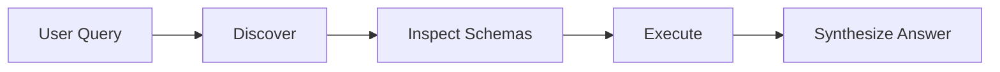

## Overview

The most powerful way to use the Context SDK is to **let your LLM do the driving**. There are two approaches:

### Option 1: Query API (Recommended)

The simplest path — let Context's server handle everything:

<CodeGroup>
```typescript TypeScript
const answer = await client.query.run("What are the top whale movements on Base?");
console.log(answer.response);  // AI-synthesized answer, tools handled server-side
```

```python Python
answer = await client.query.run("What are the top whale movements on Base?")
print(answer.response)  # AI-synthesized answer, tools handled server-side
```
</CodeGroup>

The server discovers tools, executes the full agentic pipeline (up to 100 MCP calls per tool), handles retries and completeness checks, and returns a curated answer — all for one flat fee. See the [TypeScript SDK Reference](/sdk/reference#query-pay-per-response) or [Python SDK Reference](/sdk/python-reference#query-pay-per-response) for the full API.

### Option 2: Build Your Own Loop

If you want full control over tool selection, argument construction, and result synthesis, follow the **Discovery → Schema → Execution** loop below.

<Info>
This pattern enables your agent to find and use tools it has **never seen before** — true autonomous capability discovery at runtime.
</Info>

---

## The Loop



<Steps>
  <Step title="Discover">
    Let your Agent search for tools based on the user's intent
  </Step>
  <Step title="Inspect Schemas">
    Feed discovered tool schemas to your LLM so it understands how to use them
  </Step>
  <Step title="Execute">
    When the LLM generates arguments, pass them directly to the SDK
  </Step>
</Steps>

---

## Phase 1: Discover

Let your Agent search for tools based on the user's intent. The marketplace returns relevant tools ranked by match quality.

```typescript
const tools = await client.discovery.search(userQuery);
```

**What happens:**
- The SDK searches the Context marketplace
- Returns tools matching the semantic intent of the query
- Each tool includes its name, description, price, and available methods

---

## Phase 2: Inspect Schemas

Feed the discovered tool schemas (`inputSchema`) directly to your LLM's system prompt. This allows the LLM to understand exactly how to format the arguments — **just like reading a manual**.

```typescript
const systemPrompt = `
You have access to the following tools:

${tools.map(t => `
Tool: ${t.name} (ID: ${t.id})
Description: ${t.description}
Price: ${t.price} USDC

Methods:
${t.mcpTools?.map(m => `
  - ${m.name}: ${m.description}
    Arguments: ${JSON.stringify(m.inputSchema, null, 2)}
    Returns: ${JSON.stringify(m.outputSchema, null, 2)}
`).join("\n") ?? "No methods available"}
`).join("\n---\n")}

To use a tool, respond with a JSON object: 
{ "toolId": "...", "toolName": "...", "args": {...} }
`;
```

**Why this works:**
- The LLM sees the exact JSON Schema for each tool's inputs and outputs
- It can **self-construct valid arguments** without any hardcoding
- Output schemas let the LLM know what data it will receive back

---

## Phase 3: Execute

When the LLM generates the arguments, pass them directly to the SDK.

```typescript
// The LLM generates this object based on the schema you provided
const llmDecision = await myLLM.generate(userMessage, systemPrompt);

const result = await client.tools.execute({
  toolId: llmDecision.toolId,
  toolName: llmDecision.toolName,
  args: llmDecision.args,
});

// Feed the result back to your LLM for synthesis
const finalAnswer = await myLLM.generate(
  `The tool returned: ${JSON.stringify(result.result)}. Summarize this for the user.`
);
```

---

## Handling Data (Outputs)

Context Tools return **raw, structured JSON data** (via `structuredContent`). This allows your Agent to programmatically filter, sort, or analyze results before showing them to the user.

<Note>
For large datasets (like CSVs or PDF analysis), the API may return a **reference URL** to keep your context window clean.
</Note>

---

## Full Agentic Loop Example

Here's a complete implementation of an autonomous agent using the Discovery → Schema → Execution pattern:

```typescript
import { ContextClient, ContextError } from "@ctxprotocol/sdk";

const client = new ContextClient({ apiKey: process.env.CONTEXT_API_KEY! });

async function agentLoop(userQuery: string) {
  // 1. Discover relevant tools
  const tools = await client.discovery.search(userQuery);
  
  if (tools.length === 0) {
    return "I couldn't find any tools to help with that.";
  }

  // 2. Build the system prompt with schemas
  const toolDescriptions = tools.slice(0, 5).map(t => ({
    id: t.id,
    name: t.name,
    description: t.description,
    methods: t.mcpTools?.map(m => ({
      name: m.name,
      description: m.description,
      inputSchema: m.inputSchema,
    })),
  }));

  const systemPrompt = `You are an AI assistant with access to real-time tools.

Available tools:
${JSON.stringify(toolDescriptions, null, 2)}

If you need to use a tool, respond ONLY with JSON:
{ "toolId": "...", "toolName": "...", "args": {...} }

If you can answer without a tool, just respond normally.`;

  // 3. Ask the LLM what to do
  const llmResponse = await myLLM.chat(userQuery, systemPrompt);

  // 4. Check if LLM wants to use a tool
  try {
    const toolCall = JSON.parse(llmResponse);
    
    if (toolCall.toolId && toolCall.toolName) {
      // 5. Execute the tool
      const result = await client.tools.execute({
        toolId: toolCall.toolId,
        toolName: toolCall.toolName,
        args: toolCall.args || {},
      });

      // 6. Let LLM synthesize the result
      return await myLLM.chat(
        `Tool "${toolCall.toolName}" returned: ${JSON.stringify(result.result)}
        
Please provide a helpful response to the user's original question: "${userQuery}"`
      );
    }
  } catch {
    // LLM responded with text, not JSON - return as-is
    return llmResponse;
  }
}
```

---

## Why This Pattern Matters

<CardGroup cols={2}>
  <Card title="No Hardcoding" icon="code">
    Your agent isn't limited to tools you knew about at build time.
  </Card>
  <Card title="Network Effect" icon="network-wired">
    As new builders add tools to the marketplace, your agent automatically becomes more capable without any code changes.
  </Card>
  <Card title="Self-Constructing" icon="brain">
    LLMs can read schemas and construct valid arguments autonomously.
  </Card>
  <Card title="Future-Proof" icon="rocket">
    New tools in the marketplace are instantly available to your agent.
  </Card>
</CardGroup>

---

## Error Handling in Agentic Contexts

In an agentic context, you can feed errors back to your LLM so it can **self-correct**:

```typescript
try {
  const result = await client.tools.execute({ ... });
} catch (error) {
  if (error instanceof ContextError) {
    if (error.code === "execution_failed") {
      // Feed error to LLM for retry with different args
      const retryPrompt = `The tool failed with: ${error.message}. Try different arguments.`;
      const newArgs = await myLLM.generate(retryPrompt);
      // Retry with corrected arguments...
    }
  }
}
```

This creates a **resilient agent** that can recover from errors and adapt its approach based on feedback.

